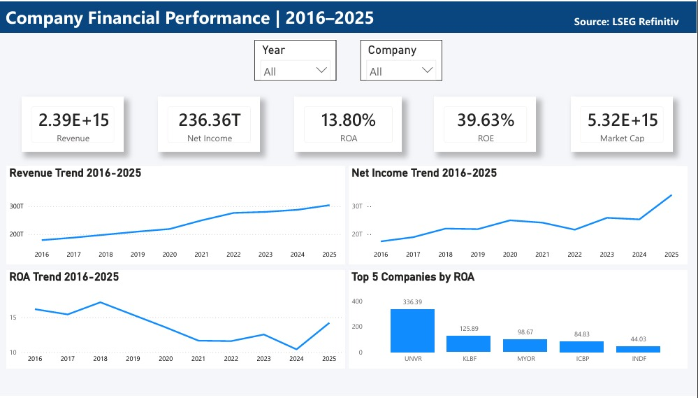
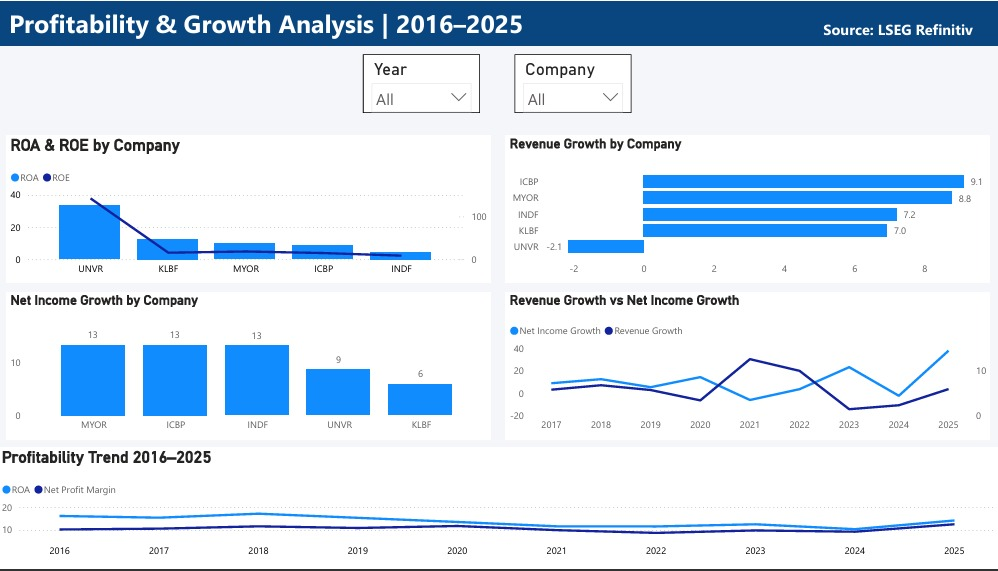
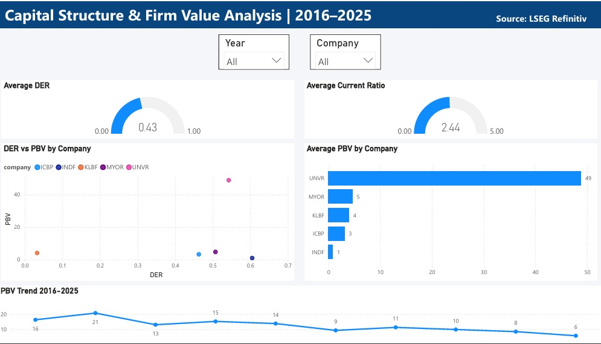

# Financial Performance Dashboard | Power BI

A financial performance dashboard built with Power BI to analyze company performance, profitability, growth, capital structure, and firm value over the 2016–2025 period.

## Project Overview

This dashboard provides an interactive view of key financial indicators across companies and years. It is designed to support financial analysis through KPI monitoring, trend analysis, company comparison, and relationship analysis.

## Tools & Data

- **Excel:** Data preparation and initial data processing
- **MySQL:** Data storage and SQL-based data processing
- **Power BI:** Data visualization and interactive dashboard development
- **Data Source:** LSEG Refinitiv
- **Period:** 2016–2025

## Dashboard Preview

### 1. Company Financial Performance

### 2. Profitability & Growth Analysis

### 3. Capital Structure & Firm Value Analysis

## Key Features

- Interactive Year and Company filters
- KPI-based financial performance overview
- Profitability and growth analysis
- Company-level financial comparison
- Capital structure analysis
- Firm value analysis using PBV
- Financial trend analysis

## Interactive Dashboard

[View Interactive Dashboard on Power BI](https://app.powerbi.com/links/yEL41614UG?ctid=96e58095-25b2-455a-bb35-c8b40452c0d9&pbi_source=linkShare)

> Note: The Power BI link may require authentication depending on the viewer's access permissions.

## Disclaimer

This project is created for portfolio and analytical purposes. Data is sourced from LSEG Refinitiv.
